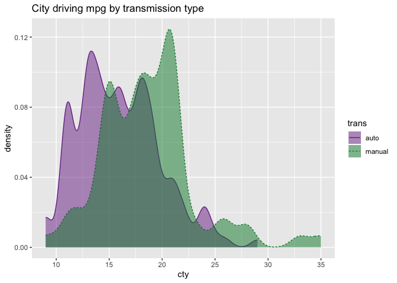

WVPlots 1.1.2 on CRAN
================
Nina Zumel
9/12/2019

I have put a new release of the [`WVPlots` package](https://winvector.github.io/WVPlots/) up on CRAN. This release adds palette and/or color controls to most of the plotting functions in the package.

`WVPlots` was originally a catch-all package of `ggplot2` visualizations that we at Win-Vector tended to use repeatedly, and wanted to turn into "one-liners." A consequence of this is that the older visualizations had our preferred color schemes hard-coded in. More recent additions to the package sometimes had palette or color controls, but not in a consistent way. Making color controls more consistent has been a "todo" for a while---one that I'd been putting off. A recent request from user Brice Richard (thanks Brice!) has pushed me to finally make the changes.

Most visualizations in the package that color-code by group now have a `palette` argument that takes the name of a Brewer palette for the graph; `Dark2` is usually the default. To use the `ggplot2` default palette, or to set an alternative palette, such as viridis or a manually specified color scheme, set `palette=NULL`. Here's some examples:

``` r
library(WVPlots)
library(ggplot2)

mpg = ggplot2::mpg
mpg$trans = gsub("\\(.*$", '', mpg$trans)

# default palette: Dark2
DoubleDensityPlot(mpg, "cty", "trans", 
                  "City driving mpg by transmission type")
```


``` r
# set a different Brewer color palette
DoubleDensityPlot(mpg, "cty", "trans", 
                  "City driving mpg by transmission type",
                  palette = "Accent")
```


``` r
# set a custom palette
cmap = c("auto" = "#7b3294", "manual" = "#008837")

DoubleDensityPlot(mpg, "cty", "trans", 
                  "City driving mpg by transmission type",
                  palette=NULL) + 
  scale_color_manual(values=cmap) + 
  scale_fill_manual(values=cmap)
```



For other plots, the user can now specify the desired color for different elements of the graph.

``` r
title = "Count of cars by number of carburetors and cylinders"

# default fill: darkblue
ShadowPlot(mtcars, "carb", "cyl",
           title = title)
```


``` r
# specify fill
ShadowPlot(mtcars, "carb", "cyl",
           title = title,
           fillcolor = "#a6611a")
```


We hope that these changes make `WVPlots` even more useful to our users. For some examples of several of the visualizations in `WVPlots`, see this [example vignette](https://winvector.github.io/WVPlots/articles/WVPlots_examples.html). For the complete list of visualizations, see the [reference page](https://winvector.github.io/WVPlots/reference/index.html).
