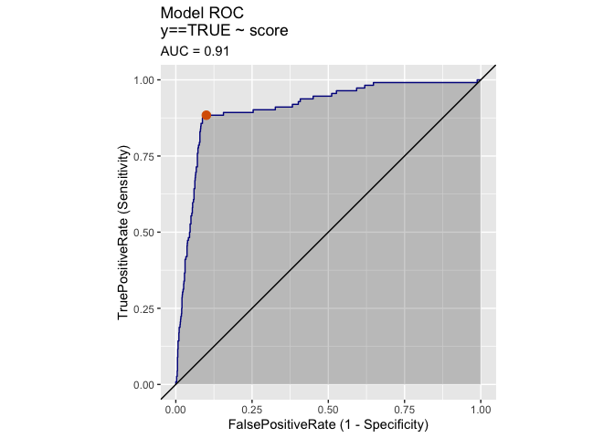
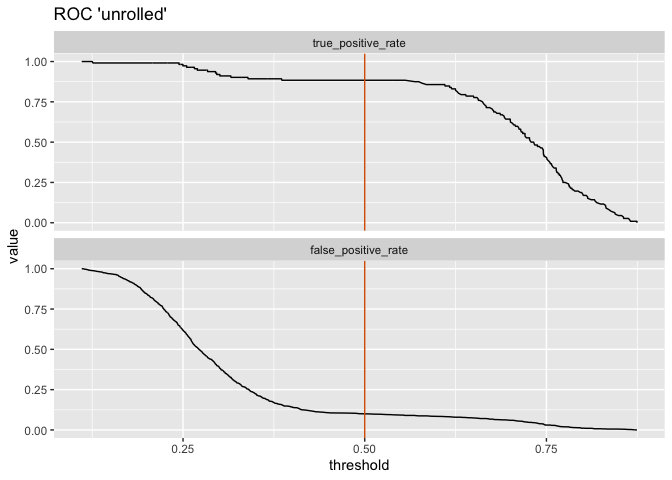
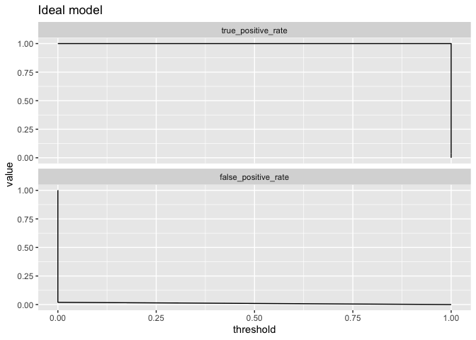
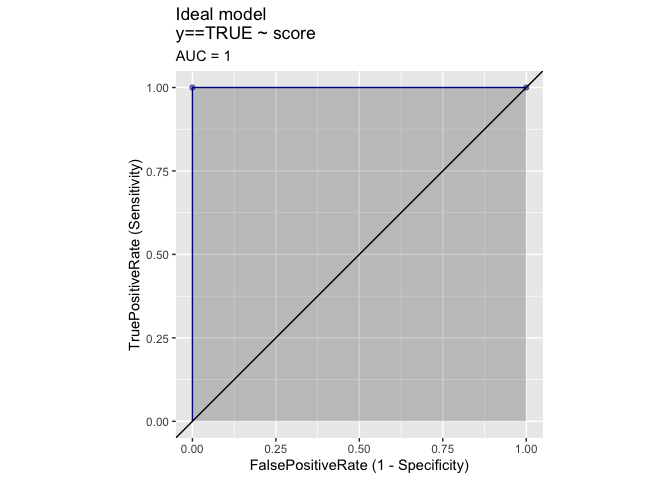
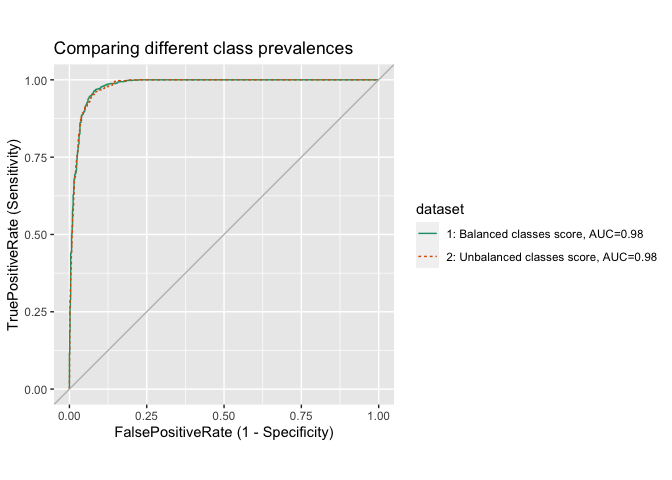
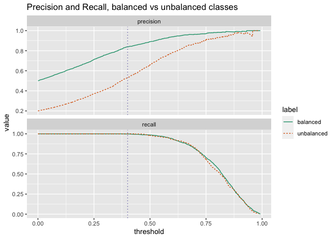

Unrolling the ROC
================
Nina Zumel

In our data science teaching, we present the ROC plot (and the area
under the curve of the plot, or AUC) as a useful tool for evaluating
classifier models, and for comparing multiple classifier models. The ROC
is informative and useful, but it’s also perhaps overly concise for a
beginner. This leads to a lot of questions from the students: what does
the ROC tell us about a model? Why is a bigger AUC better? What does it
all *mean*?

We’ll start with a simple synthetic example, where `score` is the score
produced by a trained model, and `y` is the actual outcome in the
evaluation data set (`TRUE` or `FALSE`). We’ll assume for this
discussion that the model score is a number in the unit interval, as
would be true for a probability model.

``` r
set.seed(1452225)

# sigmoid maps the real line to the unit interval
sigmoid = function(x) {
  1/(1 + exp(-x))
}

# data with two different regimes of behavior
d <- rbind(
  data.frame(
    score = sigmoid(0.4*(rnorm(1000) - 2.5) ),
    y = sample(c(TRUE, FALSE), prob = c(0.02, 0.98), 
               size = 1000, replace = TRUE)),
  data.frame(
    score = sigmoid( 0.4*(rnorm(200) + 2.5) ), 
    y = sample(c(TRUE, FALSE), size = 200, replace = TRUE))
)
```

Here’s the ROC, and its associated AUC:

``` r
library(ggplot2)
library(WVPlots)
```

``` r
ROCPlot(d, "score", "y", truthTarget=TRUE, title="Model ROC") 
```

<!-- -->

Every point of the ROC corresponds to a given *threshold*; datums that
score above the threshold are classified as positive (or TRUE, in this
case), and datums that score below the threshold are classified as
negative, or FALSE. So the ROC represents the false positive and true
positive rates of *all possible* classifiers that can be defined from
this model by varying the threshold. I’ve marked the point that
corresponds to the threshold 0.5, which is the most commonly used
threshold.

## The ROC Unrolled

To make this more explicit, let’s plot the true positive rates and false
positive rates off all possible classifiers as a function of threshold.
We can do this with the `ThresholdPlot()` function from the `WVPlots`
package.

``` r
ThresholdPlot(d, "score", "y", title="ROC 'unrolled'",
              truth_target = TRUE,
              metrics = c("true_positive_rate", "false_positive_rate")) +
  geom_vline(xintercept = 0.5, color = "#d95f02")
```

<!-- -->

I’ve added a horizontal line at `threshold = 0.5`.

The threshold plot and the ROC give us the exact same information, but
the threshold plot makes the relationship of performance to threshold
value specific. This can be useful if you are willing to tweak the
threshold to make a tradeoff. For example, if avoiding false positives
is more important to you than catching all the positive instances, you
could try a stricter threshold like 0.75. In this case, the classifier
would make fewer false positive errors, but it would also detect far
fewer positive examples, as well. On the other hand, the ROC (and the
AUC) are more convenient for comparing multiple models.

### Some Strawman Models for Intuition

The threshold plot can also give us further intuition about the ROC. We
can see that as the threshold goes to zero, both the true and false
positive rates go to one (the upper right hand corner of the ROC). As
the threshold goes to one, both the rates go to zero (the lower left
hand corner of the ROC). As the threshold increases from zero to one, it
traces out the rest of the ROC, representing all the tradeoffs between
true positive rate and false positive rate that are possible with a
given model.

**The Ideal Model**

The ideal model would predict every instance perfectly; positives would
score one, negatives would score zero. Let’s see what that would look
like.

``` r
ideal <- data.frame(score = c(rep(1, 50), rep(0, 50)),
                    y = c(rep(TRUE, 50), rep(FALSE, 50)) )

ThresholdPlot(ideal, "score", "y", title="Ideal model",
              truth_target = TRUE,
              metrics = c("true_positive_rate", "false_positive_rate")) 
```

<!-- -->

(The endpoints are plotting artifacts). With an ideal model, any
threshold produces a classification rule with a true positive rate of
one and and a false positive rate of zero. This traces out an ROC that’s
exactly the unit square:

``` r
ROCPlot(ideal, "score", "y", 
        truthTarget = TRUE, title = "Ideal model")
```

<!-- -->

So now we know ***the ideal model has an AUC of 1***. So we want our
actual model to trace out a curve as close to the ideal model as
possible; such a model should have an AUC close to 1.

**The Random Model**

What about a model that doesn’t predict anything at all, but just
returns random answers?

``` r
random <- data.frame(score = runif(1000),
                    y = c(rep(TRUE, 500), rep(FALSE, 500)) )

ThresholdPlot(random, "score", "y", title="Random model",
              truth_target = TRUE,
              metrics = c("true_positive_rate", "false_positive_rate")) 
```

<!-- -->

Both the true and false positive rates are proportional to the
threshold, and the ROC will be close to the line `x = y`.

``` r
ROCPlot(random, "score", "y",
        truthTarget = TRUE, title = "Random model")
```

<!-- -->

***A random model has an AUC near 0.5***. And a model that has an ROC
that dips below the line `x = y` (and has an AUC less than 0.5) is
actually anticorrelated with the true class labels.

## The ROC and Class Prevalence

It’s worth noting that the ROC depends on the false positive rate (the
rate at which negatives are misclassified as positives) and true
positive rate (the rate at which positives are correctly classified),
*neither of which depends on class prevalence*. That means that ***the
ROC is independent of class prevalence***. In other words, it can look
overly optimistic when the target class is rare.

To demonstrate, let’s look at two situations that have been designed to
generate the same ROC (for the code to generate this example, see [the R
markdown for this
article](https://github.com/WinVector/WVPlots/blob/main/Examples/PickingThresholds/UnrollingROC.Rmd)).
The first example is a model applied to a balanced-class situation, the
second to a situation where the positive class is relatively rate (about
20%).

``` r
table(balanced$y)
```

    ## 
    ## FALSE  TRUE 
    ##  1000  1000

``` r
table(unbalanced$y)
```

    ## 
    ## FALSE  TRUE 
    ##  1600   400

``` r
ROCPlotPair2(nm1 = "Balanced classes", # model 1
             frame1 = balanced,
             xvar1 = "score",  truthVar1 = "y", truthTarget1 = TRUE,
             nm2 ="Unbalanced classes", # model 2
             frame2 = unbalanced,
             xvar2 = "score", truthVar2 = "y", truthTarget2 = TRUE,
             title = "Comparing different class prevalences",
             estimate_sig = FALSE)
```

<!-- -->

As designed, the ROC is nearly identical in both situations, with a high
AUC. These both look like good models.

But suppose instead of false positive rate, you are worried about
*precision* (the probability that a instance predicted to be positive is
actually positive). With respect to precision, the two models behave
quite differently.

<!-- -->

Both models have identical recall (which is the same as true positive
rate, and is independent of class prevalence), but the model that is
applied to a population where the positive class is rare will have much
lower precision for any useful setting of the classifier threshold.

Incidentally, this is why when evaluating what a positive result of a
medical screening test means, it’s important to know the prevalence of
the disease (or other medical condition) in the population. Medical
screening tests are generally designed to meet certain levels of
sensitivity (true positive rate) and specificity (1 - false positive
rate); these measures are independent of the disease prevalence.

Suppose that the example in the graph above showed a screening test
applied to two different populations. We want to make sure that we
identify everyone who has the disease, so we set the threshold at 0.4
(the vertical line on the graph), so the recall is close to one. If 50%
of the population has the disease, then 8 out of 10 people who test
positive will actually be positive. But if only 20% of the population
has the disease, then nearly half the people who test positive are
actually negative.

## Let’s Sum It All Up

What have we established in this article?

  - The ROC and AUC are useful for quickly comparing multiple models. In
    a comparison, higher AUCs generally mean better models.

  - Something like `WVPlots::ThresholdPlot` can be useful for setting
    appropriate classifier thresholds. For an extended example of
    `ThresholdPlot`, see
    [here](https://github.com/WinVector/WVPlots/blob/main/Examples/PickingThresholds/PickingThresholds.md).

  - An AUC close to one is good; an AUC close to 0.5 means the model
    doesn’t perform much better than random.

  - ROC (along with true positive and false positive rates) are
    independent of class prevelance. Precision is dependent on class
    prevelance.

  - If your preferred performance metric is dependent on class
    prevelance, like precision or accuracy, then the ROC may be
    optimistic. `ThresholdPlot` can also be useful for evaluating a
    model in this situation.

Hopefully, you now have a better intuition about the ROC, and what it
means.
